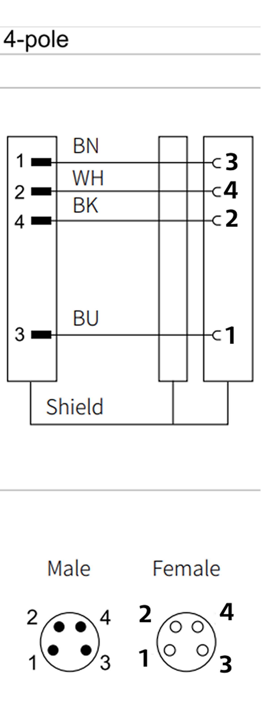
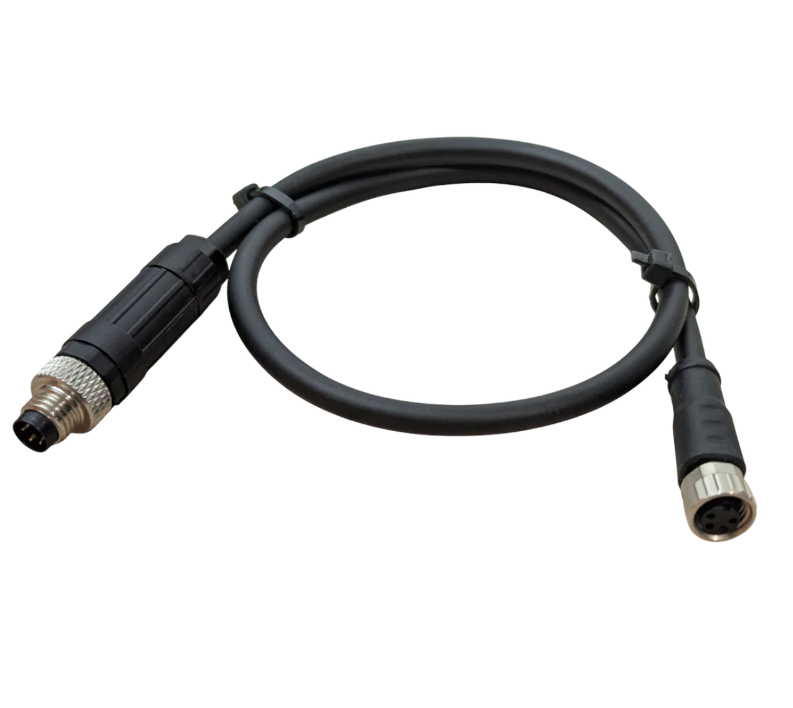

## MSG & SSG48 gripper cable

Buy Official cables from Source Robotics: [Link](https://source-robotics.com/)

Parts needed if DIY your own cable:

| Type | Length / Spec | Quantity | Description | Link |
|------|---------------|----------|-------------|------|
| 26 AWG cable | 0.15 mm², 4-wire twisted pair | 0.4 m | ~40 cm usually sufficient | [Link](https://s.click.aliexpress.com/e/_c4m3ggwn) |
| M8 4-pin male wire connector | — | 1 | [See reference image](../Photos/M8%20male.png) |[Link](https://s.click.aliexpress.com/e/_c4OWHPKF) |
| M8 4-pin female wire connector | — | 1 | [See reference image](../Photos/M8_female.png) | [Link](https://s.click.aliexpress.com/e/_c4OWHPKF) |

> [!NOTE]
>     **PAROL6 and PAR6 use different cables for SSG48 and MSG grippers. Using incorrect one can damage your robot**

## Wire diagram for PAROL6 robotic arm

## Wire diagram for PAR6 robotic arm

## Final look of the cable 

End result of this cable assembly needs to look like this:

